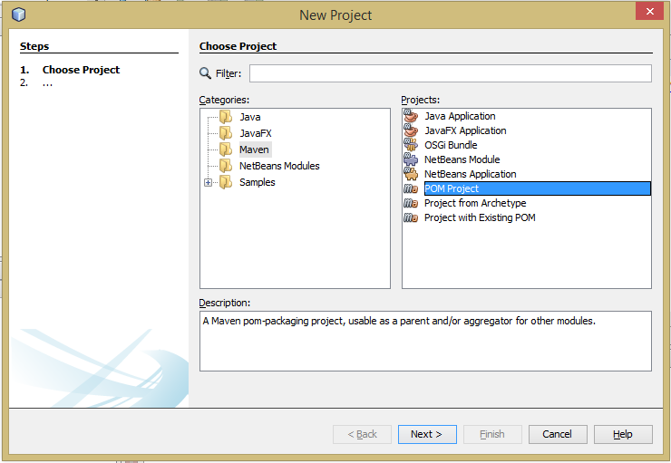
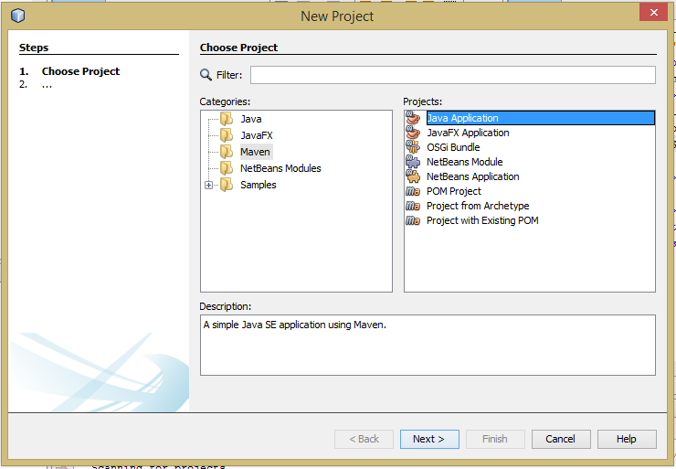
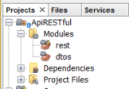
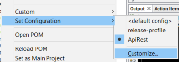
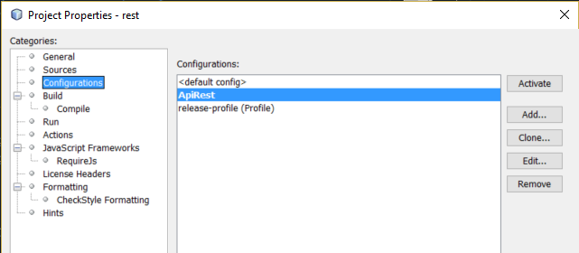
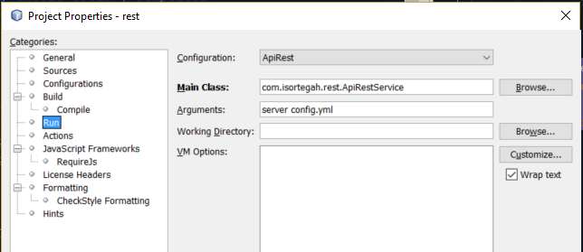
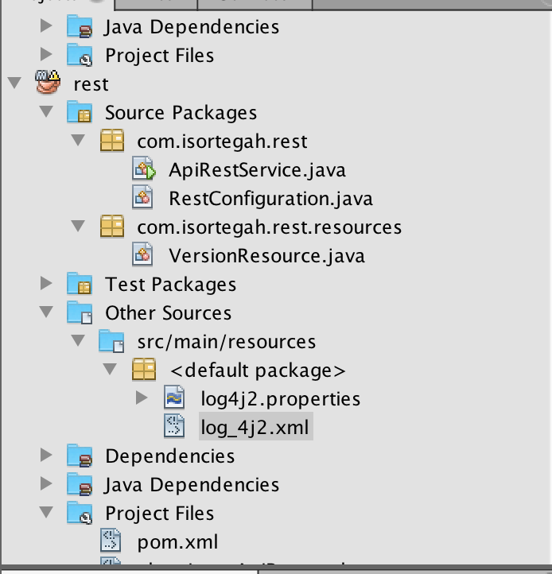
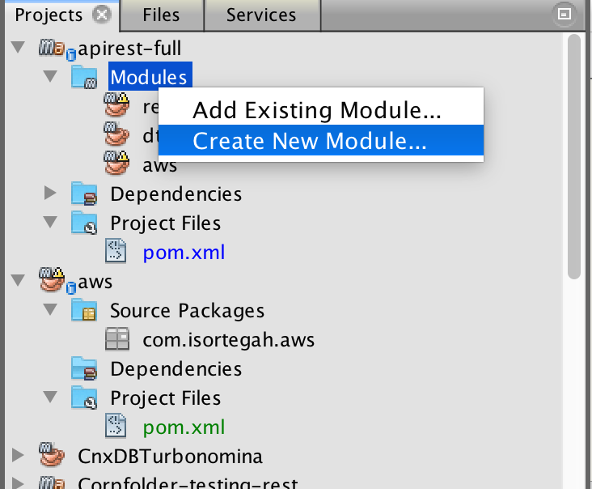
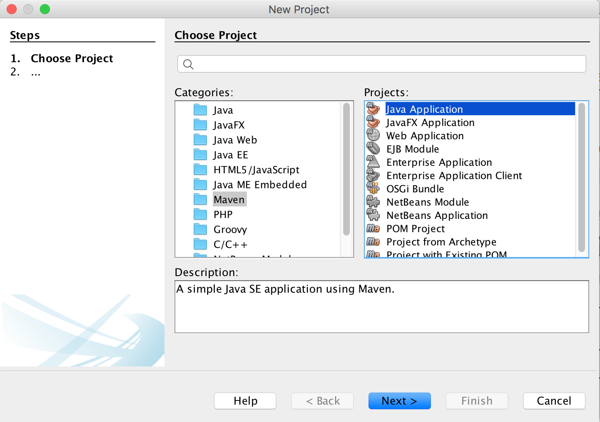
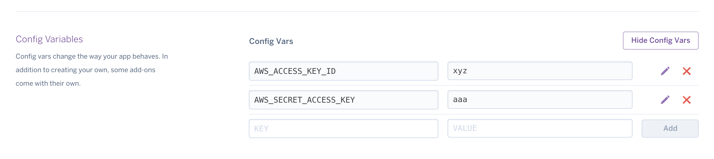

# APIREST-FULL

## Indice
### Iniciando Proyecto Base
* [Creación de proyecto en NetBeans](#creacion-de-proyecto-en-netbeans)
* [Ajustes en el POM](#ajustes-en-el-pom)
* [Creando la clase de Configuración](#creando-la-clase-de-configuracion)
* [Crear la clase de la aplicación](#crear-la-clase-de-la-aplicacion)
* [Crear clase ejemplo](#crear-clase-ejemplo)
* [Configuración ejecución en NetBeans](#configuracion-ejecucion-en-netbeans)
* [Proceso de dockerizacion](#proceso-de-dockerizacion)

### [Adicionales](#adicionales)
* [Log4j2](#log4j2)
* [Heroku](#heroku)
* [Jwt](#jwt)

### [Temas a considerar](#temas-a-considerar)

## Creacion de proyecto en NetBeans

* El proyecto parent fue creado en NetBeans con la opción: `Maven -> POM Project`  

  

* Para los modulos se utiliza la opción: `Maven -> Java Application`



[Arriba](#indice)

## Ajustes en el POM

* Agregar propiedad de versión de Dropwizard
```xml
    <properties>
        <dropwizard.version>INSERT VERSION HERE</dropwizard.version>
    </properties>
```
* Adicionar la libreria como dependencia.
```xml
<dependencies>
    <dependency>
        <groupId>io.dropwizard</groupId>
        <artifactId>dropwizard-core</artifactId>
        <version>${dropwizard.version}</version>
    </dependency>
</dependencies>
```
[Arriba](#indice)

## Creando la clase de Configuracion

* Crear clase `RestConfiguration.java` base:

```java
import com.fasterxml.jackson.annotation.JsonProperty;
import io.dropwizard.Configuration;
import org.hibernate.validator.constraints.NotEmpty;
import io.federecio.dropwizard.swagger.SwaggerBundleConfiguration;

/**
 *
 * @author ISORTEGAH
 */
public class RestConfiguration extends Configuration{
    @NotEmpty
    @JsonProperty
    private String baseUrl;

    public String getBaseUrl() {
        return baseUrl;
    }

    public void setBaseUrl(String baseUrl) {
        this.baseUrl = baseUrl;
    }
    
    @JsonProperty("swagger")
    public SwaggerBundleConfiguration swaggerBundleConfiguration;
}
```
> Referencia a [ejemplo](https://github.com/dropwizard/dropwizard/blob/master/dropwizard-example/src/main/java/com/example/helloworld/HelloWorldConfiguration.java) básico


* Adicionar al `pom.xml` del modulo `rest` la siguiente dependencia:

```xml
<dependency>
    <groupId>com.smoketurner</groupId>
    <artifactId>dropwizard-swagger</artifactId>
    <version>1.0.0-rc2-1</version>
</dependency>
```

* Contruir el archivo de configuración `config.yml`  
```yml
baseUrl: http://localhost
swagger:
    resourcePackage: com.corpfolder.rest.resources
server:
  applicationConnectors:
    - type: http
      port: 8080
```
[Arriba](#indice)
## Crear la clase de la aplicacion
> * Dentro del siguiente código se puede ver la integración de swagger como opción de exposición gráfica de los servicios.
```java
import io.dropwizard.Application;
import io.dropwizard.setup.Bootstrap;
import io.dropwizard.setup.Environment;
import io.federecio.dropwizard.swagger.SwaggerBundle;
import io.federecio.dropwizard.swagger.SwaggerBundleConfiguration;

/**
 *
 * @author ISORTEGAH
 */
public class ApiRestService extends Application<RestConfiguration>{
    
    public static void main(String[] args) throws Exception {
            new ApiRestService().run(args);
    }
    
    @Override
    public void initialize(Bootstrap<RestConfiguration> bootstrap) {
        bootstrap.addBundle(new SwaggerBundle<RestConfiguration>() {
            protected SwaggerBundleConfiguration getSwaggerBundleConfiguration(RestConfiguration configuration) {
                return configuration.swaggerBundleConfiguration;
            }           
        });
    }

    @Override
    public void run(RestConfiguration configuration,
                    Environment environment) {
    }
```
* Adicionar plugins de contrucción del jar
```xml
    <build>
	<plugins>
            <plugin>
                    <groupId>org.apache.maven.plugins</groupId>
                    <artifactId>maven-surefire-plugin</artifactId>
                    <version>2.17</version>
                    <configuration>
                            <skipTests>true</skipTests>
                    </configuration>
            </plugin>
            <plugin>
                <groupId>org.apache.maven.plugins</groupId>
                <artifactId>maven-shade-plugin</artifactId>
                <version>2.1</version>
                <executions>
                    <execution>
                        <phase>package</phase>
                        <goals>
                            <goal>shade</goal>
                        </goals>
                        <configuration>
                            <transformers>
                                <transformer implementation="org.apache.maven.plugins.shade.resource.ServicesResourceTransformer"/>
                                <transformer
                                    implementation="org.apache.maven.plugins.shade.resource.ManifestResourceTransformer">
                                    <mainClass>com.isortegah.rest.ApiRestService</mainClass>
                                </transformer>
                            </transformers>
                        </configuration>
                    </execution>
                </executions>
            </plugin>
            <plugin>
                    <groupId>org.codehaus.mojo</groupId>
                    <artifactId>exec-maven-plugin</artifactId>
                    <version>1.2.1</version>
                    <executions>
                        <execution>
                            <goals>
                                <goal>java</goal>
                            </goals>
                        </execution>
                    </executions>
                    <configuration>
                            <mainClass>com.isortegah.rest.ApiRestService</mainClass>
                            <arguments>
                                    <argument>server</argument>
                                    <argument>config.yml</argument>
                            </arguments>
                    </configuration>
            </plugin>
        </plugins>
    </build>
```
[Arriba](#indice)
## Crear clase ejemplo 

`VersionResource.java`

```java
import com.codahale.metrics.annotation.Timed;
import com.isortegah.dtos.res.version.VersionDTO;
import io.swagger.annotations.Api;
import io.swagger.annotations.ApiOperation;
import javax.ws.rs.GET;
import javax.ws.rs.Path;
import javax.ws.rs.Produces;
import javax.ws.rs.core.MediaType;

/**
 *
 * @author ISORTEGAH
 */
@Path("/version")
@Api(value = "/version")
@Produces(MediaType.APPLICATION_JSON)
public class VersionResource {
    @GET
    @Timed
    @ApiOperation(value = "Obtiene la información de la versión", position = 0)
    public VersionDTO version() {
        
       return new VersionDTO();
       
    }
}
```

* Adicionar modulo `dtos`



* Crear la clase `VersionDTO.java`


import com.fasterxml.jackson.annotation.JsonProperty;
```java
/**
 *
 * @author ISORTEGAH
 */
public class VersionDTO {
    
    @JsonProperty
    private String nombre = "Versión 0.0.1-SNAPSHOT";

    @JsonProperty
    private String numero = "0.0.1";
    
    @JsonProperty
    private String autor = "ISORTEGAH";

    public String getAutor() {
        return autor;
    }

    public void setAutor(String autor) {
        this.autor = autor;
    }

    public String getNombre() {
            return nombre;
    }

    public void setNombre(String nombre) {
            this.nombre = nombre;
    }

    public String getNumero() {
            return numero;
    }

    public void setNumero(String numero) {
            this.numero = numero;
    }
    
}
```
* Adicionar la dependencia del modulo `dtos` al `pom.xml` del modulo `rest`

```xml
<dependency>
    <groupId>${project.groupId}</groupId>
    <artifactId>dtos</artifactId>
    <version>${project.version}</version>
    <type>jar</type>
</dependency>  
```

* Registrar el servicio en `ApiRestService.java`
```java
@Override
    public void run(RestConfiguration configuration,
                    Environment environment) {
        environment.jersey().register(new VersionResource());
    }
```
[Arriba](#indice)
## Configuracion ejecucion en NetBeans

* Adicionar `Configutarion` sobre modulo `rest`  


* Registrar la configuración  


* Seleccionar la opción `Run` y dentro seleccionar la configuración adicionada con los siguientes parametros:
> Main Class: com.isortegah.rest.ApiRestService  
> Arguments: server config.yml  


[Arriba](#indice)
## Proceso de dockerizacion

1. Crear `Dockerfile`
```bash
FROM isortegah/java8:v1


EXPOSE 8080

RUN mkdir -p /app
WORKDIR /app

ADD bootstrap.sh bootstrap.sh
ADD rest/target/rest-0.1-SNAPSHOT.jar rest.jar
ADD config.yml config.yml

ENTRYPOINT ["/bin/bash", "./bootstrap.sh"]
```
2. Crear archivo `bootstrap.sh`
```bash
#!/usr/bin/env bash
java -jar rest.jar server config.yml
```
3. Construcción de imagen
```
docker build -t api-rest .
```

4. Ejecución de imagen

```
docker run -it -p 8080:8080 < imagen id >
```
5. Ejecutar bash
```
docker exec -it < id container > /bin/bash
```

6. Borrar contenedores finalizados
```
docker ps -a | egrep Exited | cut -d ' ' -f 1|xargs docker rm
```
7. Borrar imagenes < none >
```
docker images | egrep none | cut -c 41-53| xargs docker rmi
```
## Adicionales

## Log4j2

* Agregar al POM del proyecto la siguiente dependencia:
```xml
<dependency> 
    <groupId>org.apache.logging.log4j</groupId> 
    <artifactId>log4j-core</artifactId>
    <version>2.8.2</version> 
</dependency>
```
* Agregar el archivo de configuración en la carpeta `resource` del proyecto, con el nombre `log4j.<properties|xml|yaml|json>`.  

[Ejemplos](ApiRESTfull/rest/src/main/resources)

   

* Código Java  
```java
import org.apache.logging.log4j.LogManager; 
import org.apache.logging.log4j.Logger; 

//Ejemplo de declaración de variable 
private static final Logger log = LogManager.getLogger("VersionResource");  

//Ejemplo de implementación
log.info("Se requiere servicio version"); 
```
[Log4j Users Guide](http://logging.apache.org/log4j/2.0/log4j-users-guide.pdf)  
[Referencia 1](https://logging.apache.org/log4j/2.x/manual/configuration.html#Properties)  
[Referencia 2](http://www.journaldev.com/7128/log4j2-example-tutorial-configuration-levels-appenders)  
[Referencia 3](https://examples.javacodegeeks.com/enterprise-java/log4j/log4j-2-rollingfileappender-example/)  
[Referencia 4](http://memorynotfound.com/log4j2-with-log4j2-xml-configuration-example/)  
[Referencia 5](https://github.com/apache/logging-log4j2/tree/master/log4j-core/src/test/resources)  
[Referencia 6](http://mycuteblog.com/log4j2-xml-configuration-example/)

## Heroku
Pre requisitos
* Instalación de [Heroku Cli](https://devcenter.heroku.com/articles/heroku-cli)

* Crear app en Heroku

```
heroku create < nombre app >
```
* Establecer buildpack
```
heroku buildpacks:set heroku/java
```

Despliege en Heroku 
* Crear archivo `Procfile``
```bash
web: java -Ddw.server.applicationConnectors[0].port=$PORT -jar rest/target/rest-0.1-SNAPSHOT.jar server config.yml
```
* Desplegar app
```
git push heroku master
```

Esta aplicación la podemos ver funcionando en [api.isortegah.com/swagger](http://api.isortegah.com/swagger) **Nota:** Se encuentra desplegada como contenedor Docker.

**Despliegue en heroku como docker**

* Instalar plugin
```
heroku plugins:install heroku-container-registry
```
* Login en contenedor
```
heroku container:login
```
* Push codigo
```
heroku container:push web
```
* Correr bash en heroku
```
heroku run bash
```
**Referencia:**   

[Container Registry and Runtime](https://devcenter.heroku.com/articles/container-registry-and-runtime)

[Push multiple Docker images to Heroku Container Registry](https://devcenter.heroku.com/changelog-items/1191)

[Container Registry and Runtime | Heroku Dev Center](https://devcenter.heroku.com/articles/container-registry-and-runtime)


Especificar versión de Java

* Crear archivo `system.properties`
```
"java.runtime.version=1.8" 
```
* Verificar la versión de java en Heroku
```
heroku run java -version
```
[Referencia 1](https://devcenter.heroku.com/articles/java-support#specifying-a-java-version)

## [JWT](#jwt)


## Aws

* Crear modulo `aws`

> 

> 
* Adicionar dependencia a `pom.xml` 
```xml
<dependencies>       
        <dependency>
            <groupId>com.amazonaws</groupId>
            <artifactId>aws-java-sdk-s3</artifactId>
            <version>1.11.163</version>
        </dependency> 
    </dependencies>
```
* Adicionar al archivo `config.yml` la configuración para `aws`
```yaml
aws: 
  credentialProvider: < File|Environment >
```

Se implementan dos formas para la obtencion de las credenciales de `aws`, por el archivo `credentials`y por variables de ambiente.

Para la implementación de las credienciales verificar en el resultado del siguiente [Compare en gitHub](https://github.com/isortegah/apirest-full/compare/4d3a91486f242db456f063ba5c7bbaa80419d209...fa5addc0fb57a98174f44edbeae5235af2657274) los cambios a los siguientes archivos:

> `rest/src/main/java/com/isortegah/rest/ApiRestService.java`
> `rest/src/main/java/com/isortegah/rest/RestConfiguration.java`
> `aws/pom.xm`
> `aws/src/main/java/com/isortegah/aws/AwsCredentials.java`
> `aws/src/main/java/com/isortegah/aws/AwsS3.java`
> `dtos/src/main/java/com/isortegah/dtos/configAws/ConfigAws.java`

Para el caso de las credenciales vía variables de ambiente el proceso es el siguiente:

* Exportar las variables:
```bash
export AWS_ACCESS_KEY_ID="xyz"
export AWS_SECRET_ACCESS_KEY="aaa"
```
En MacOs y Linux agregarlas en el archivo .bashrc o .bash_profile y recargarlo.
```bash
source .bash_profile
```
Para Windows usar el comando:
```bash
set AWS_ACCESS_KEY_ID="xyz"
set AWS_SECRET_ACCESS_KEY="aaa"
```
Lo anterior para poder ejecutar el comando:
```bash
java -jar rest/target/rest-0.1-SNAPSHOT.jar server config.yml
```
* En el archivo `config.yml`cambiar el valor `File` por `Environment`.
```yaml
aws: 
  credentialProvider: Environment
``` 

Para la implementación de las credenciales vía variables de ambiente ver la siguiente [Comparación en github](https://github.com/isortegah/apirest-full/compare/8fc54b34f077b1752faa978dee0b07db91f0834d...cbd8c5ebd75e82e147f950b187a13b05be380727), los archivos a revisar son:

> `aws/src/main/java/com/isortegah/aws/AwsCredentials.java`

**Ejecución**

Se presentan las siguientes opciones de ejecución de la imagen docker.

* De forma directa:

```bash
docker run -it -p 8080 -e AWS_ACCESS_KEY_ID=xyzqwd -e AWS_SECRET_ACCESS_KEY=aaa fba5ce1e06db
```
* Vía docker-compose:  
    * Crear archivo `docker-compose.yml`
```yml
version: '3'
services:
  web:
    image: api-rest
    env_file: 
      - ./.env
    environment: 
      - AMBIENTE="DEV"
    ports: 
      - "8080:8080"
```

* 
    * Crear archivo `.env` donde registraremos las variables de ambiente

```bash
AWS_ACCESS_KEY_ID=xyz
AWS_SECRET_ACCESS_KEY=aaa
```

**Nota:** Lo recomendable por practico y seguro, cuando ejecutemos en local, es usar el docker-compose, en el caso que estemos desarrollando podemos utilizar el archivo de credenciales.

* Despliege a heroku:

Agregar las variables de ambiente en `settings` dentro de la app en `heroku`.


### **Referencia**

**Instalacion**
> [Instalación de la AWS CLI con el instalador agregado (Linux, macOS, or Unix)](http://docs.aws.amazon.com/es_es/cli/latest/userguide/awscli-install-bundle.html#install-bundle-user)

**Credenciales**
> [set](http://docs.aws.amazon.com/cli/latest/reference/configure/set.html)
> [Environment Variables](http://docs.aws.amazon.com/cli/latest/userguide/cli-environment.html)
> [aws doc](http://docs.aws.amazon.com/sdk-for-java/v1/developer-guide/credentials.html#credentials-file-format)  
> [Working with AWS Credentials](http://docs.aws.amazon.com/sdk-for-java/v1/developer-guide/credentials.html)
> [Loading Credentials in Node.js from the Shared Credentials File](http://docs.aws.amazon.com/sdk-for-javascript/v2/developer-guide/loading-node-credentials-shared.html)

https://javatutorial.net/java-s3-example
http://docs.aws.amazon.com/sdk-for-java/v1/developer-guide/setup-credentials.html

**Docker**  

[Environment variables in Compose](https://docs.docker.com/compose/environment-variables/#the-env-file)

## Temas a considerar

* [AssetsBundle](http://www.dropwizard.io/0.7.0/dropwizard-assets/apidocs/io/dropwizard/assets/AssetsBundle.html)


Picked up JAVA_TOOL_OPTIONS: -Xmx350m -Xss512k -Dfile.encoding=UTF-8